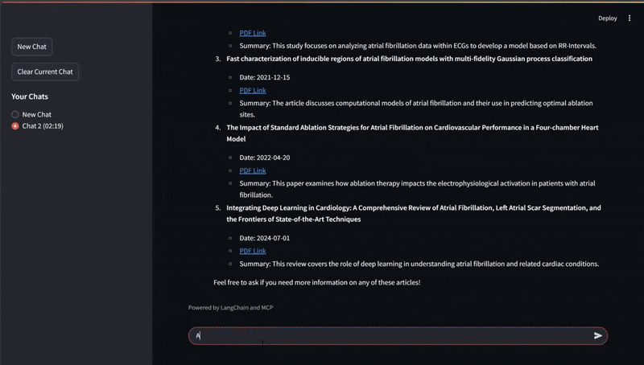
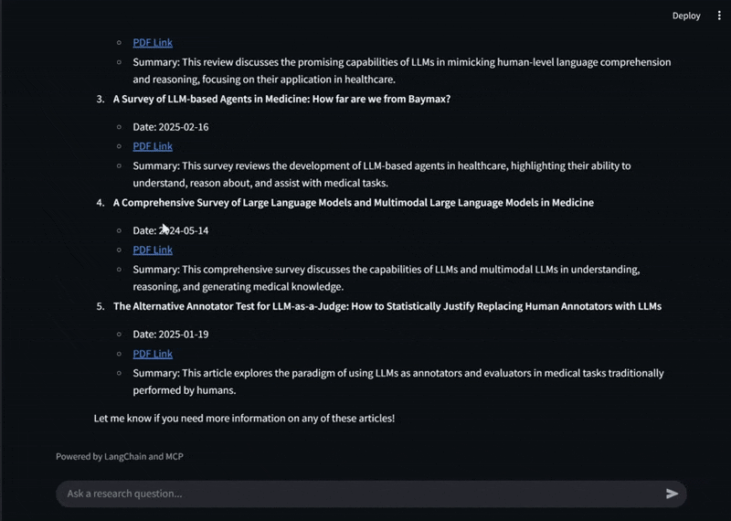

# MCP Research Assistant Demo

## Overview
This project demonstrates a research assistant application built using Model Control Protocol (MCP), LangChain, FastAPI, and Streamlit. It showcases how to create a modular AI system with MCP servers and Langchain.
This demo can search and analyze scientific papers, provide linguistic analysis on documents, and create a user-friendly interface for interacting with these AI capabilities.

<!--   
 -->
<div align="center">
  
  
</div>

## Architecture
This demo consists of three main components:

1. MCP Servers:
  - ArXiv Server: Provides tools for searching and retrieving scientific papers from ArXiv
  - DocLing Server: Offers document linguistics tools for analyzing and understanding text
2. FastAPI Client Server:
  - Acts as the coordination layer between the MCP servers
  - Implements a research assistant agent that uses tools from both MCP servers
  - Exposes an API for interacting with the assistant
3. Streamlit UI:
  - Provides a user-friendly web interface
  - Allows users to query the research assistant
  - Displays search results, paper analyses, and other outputs

## How It Works
1. User submits a research question or request through the Streamlit UI
2. The request is sent to the FastAPI client server
3. The client server uses the MultiServerMCPClient to coordinate with multiple MCP servers
4. Based on the request, the appropriate tools are invoked (ArXiv search, document analysis, etc.)
5. Results are processed and returned to the Streamlit UI for display

## Getting Started

**Environment Setup**  
Copy the template environment file:
```bash
cp .env.template .env
```
Edit the `.env` file with your API keys and configurations

**Running with Docker Compose**  
The easiest way to run the entire application is using Docker Compose:
```bash
docker-compose up -d
```
This will start all components:
- ArXiv server on port 8000
- DocLing server on port 8001
- Client server on port 8002
- Streamlit UI on port 8501

Then visit [here](http://localhost:8501) to access the Streamlit UI.